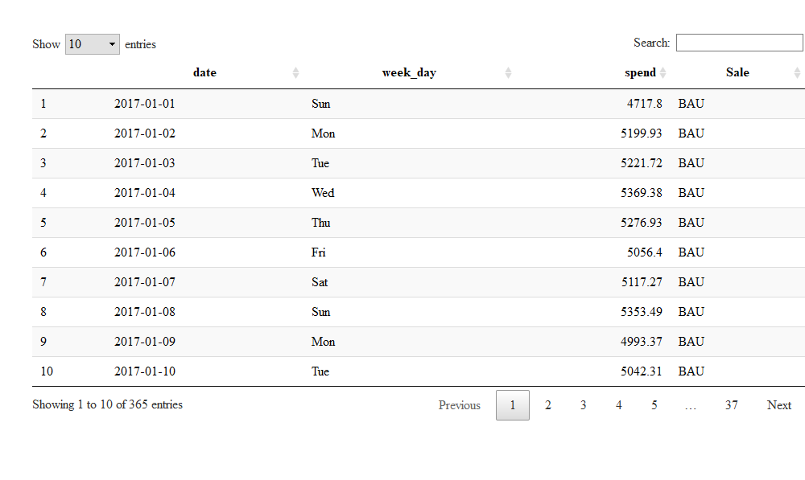
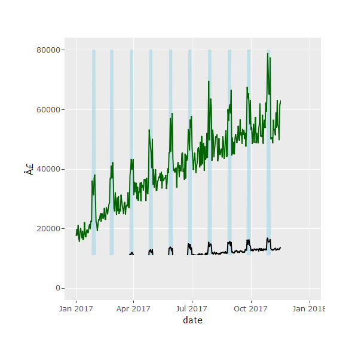

## Marketing Revenue App - Introduction
This app explores how we can predict revenue generated from digital marketing
 based on a company that puts on a sale at the end of every Month. The 
 prediction model will account for spend, whether a sale is on or not, and what weekday it is. The user of this app should be able to read how this data was 
 made, and use sliders to change the nature of the underlying dataset: for 
 example making Wednesday a more profitable day for the company.
 
The first model summary table helps the user understand the relevance of weekdays on revenue. A boolean (true/false) variable was created for each day of week. A linear regression is then calculated for each of these variables, and some stats from the output are presented in each row. In each regression, revenue is modelled based on spend, and whether the day is the particular weekday in question or not. 

In the table of weekday models, statistically significant weekdays are highlighted in green.

The user can change the reference value for this categorical weekday variable, 
and see how this is reflected in the model output.

At the same time, the second model output shows a single regression model's 
output, where weekdays are modelled as a single factor variable with an outcome
for each weekday. The user can switch between reference values for this variable. 
The output for each weekday shows the uplift or decrese in revenue generated 
for that day compared to the reference day. Note that if the reference day is Thursday, and Thursdays generate much more revenue than any other day, all
the p values for other weekdays will be significant versus Thursday. (This is 
how the default layout is set).

Reducing the number of possible outcomes in a categorical variable like weekdays 
can improve the model, and its ability to cope with data of less ariation or 
a smaller size. But making the best choice isn't very easy to automate. 


##Marketing Data Generation

On this page, I have written out the process of making our underlying
imaginary digital marketing data set - how I made results improve over the year, during sales, etc.

This data is approximately replicated in the interactive app, with controls 
given to change the increase in revenue on each weekday, with an aim to add
further features.

## Generating Some Example Marketing Data.

First of all, let's generate a range of dates which will represent our existing historical data range:


```r
date_seq <- seq(ymd("2017-01-01"),ymd("2017-12-31"),"days")

historic <- data.frame(date = date_seq)

historic$week_day <- lubridate::wday(historic$date, label=TRUE)

historic %>% head 
```

```
##         date week_day
## 1 2017-01-01      Sun
## 2 2017-01-02      Mon
## 3 2017-01-03      Tue
## 4 2017-01-04      Wed
## 5 2017-01-05      Thu
## 6 2017-01-06      Fri
```

Next up, we will make some assumptions about how the budget is planned on this imaginary account.
Each Month, for the last 5 days of the Month, there will be a sale.
When a sale is on, spend will increase.

So let's build our spend variable...
We will have a constant spend, which fluctuates randomly from day to day.
When a sale is on, spend will increase by 50% or so.

In step 1, we create a base spend rate, which varies a random amount each day, also assuming they have been ramping up spend over the year:


```r
historic$spend <- 5000 

for (i in 2:nrow(historic)) {
  historic$spend[i] <- (historic$spend[i-1] + runif(1, min=30, max=50) - i/11) %>% round(2)
}

for (i in 1:nrow(historic)) {
  historic$spend[i] <- (historic$spend[i] + runif(1, min=-500, max=500)) %>% round(digits = 2)
}

historic %>% head %>% formattable()
```


<table class="table table-condensed">
 <thead>
  <tr>
   <th style="text-align:right;"> date </th>
   <th style="text-align:right;"> week_day </th>
   <th style="text-align:right;"> spend </th>
  </tr>
 </thead>
<tbody>
  <tr>
   <td style="text-align:right;"> 2017-01-01 </td>
   <td style="text-align:right;"> Sun </td>
   <td style="text-align:right;"> 5286.35 </td>
  </tr>
  <tr>
   <td style="text-align:right;"> 2017-01-02 </td>
   <td style="text-align:right;"> Mon </td>
   <td style="text-align:right;"> 5292.45 </td>
  </tr>
  <tr>
   <td style="text-align:right;"> 2017-01-03 </td>
   <td style="text-align:right;"> Tue </td>
   <td style="text-align:right;"> 5260.17 </td>
  </tr>
  <tr>
   <td style="text-align:right;"> 2017-01-04 </td>
   <td style="text-align:right;"> Wed </td>
   <td style="text-align:right;"> 5436.70 </td>
  </tr>
  <tr>
   <td style="text-align:right;"> 2017-01-05 </td>
   <td style="text-align:right;"> Thu </td>
   <td style="text-align:right;"> 5018.66 </td>
  </tr>
  <tr>
   <td style="text-align:right;"> 2017-01-06 </td>
   <td style="text-align:right;"> Fri </td>
   <td style="text-align:right;"> 4852.17 </td>
  </tr>
</tbody>
</table>

```r
plot1 <- historic %>% 
  ggplot(aes(x = date, y = spend)) +
  geom_line() +
  ylim(0, 20000) 

ggplotly(plot1)
```


Now let's list the dates where we will be in sale, as a function of the last 5 days of each month.


```r
historic <- historic %>% 
  mutate(Sale = case_when(date >= ceiling_date(date, "month")-6 & date <= ceiling_date(date, "month")-1 ~ "Sale",
         !(date >= ceiling_date(date, "month")-6 & date <= ceiling_date(date, "month")-1) ~ "BAU"))

historic %>% datatable
```



Now we need to make spend increase during sale periods.


```r
for (i in 1:nrow(historic)) {
  if (historic$Sale[i]=="Sale") {
    historic$spend[i] <- (historic$spend[i] + runif(1, min=2000, max=4000)) %>% round(2)
  }
}

historic$Salevec <- historic$Sale %in% c("Sale")

maxspend <- max(historic$spend)

plot2 <- historic %>% 
  ggplot(aes(x = date, y = spend)) +
   geom_area(aes(y=Salevec*max(spend)), fill="light blue", alpha = .7) +
  geom_line(aes(x = date, y = spend)) +
  ylim(0, maxspend+1000) + ylab("£")

ggplotly(plot2)
```


Now we have some spend data! So now we have to make some imaginary revenue. I suggest we assume that revenue is  an increasing function of spend, with some randomness. Then let's increase revenue during sales to get a relatively random but strong effect of a larger return on investment from advertising.

Over time performance will improve slowly, and during sales it will also improve.


```r
historic$revenue <- 0
for (i in 1:nrow(historic)) {
    historic$revenue[i] <- (historic$spend[i] * (3.5 + runif(1, min=-.5, max=.5)+i/400)) %>% round(2)
}

for (i in 1:nrow(historic)) {
  if (historic$Sale=="Sale") {
    historic$revenue[i] <- historic$revenue[i] * (runif(1, min=2, max=4)+i/100)
  }
}

maxsrev <- max(historic$revenue)

plot3 <- historic %>% ggplot(aes(x=date)) + 
  geom_area(aes(y=Salevec*max(revenue)), fill="light blue", alpha = .7) + geom_line(aes(y = revenue), col='dark green') +
  geom_line(aes(y= spend)) +
  ylab("£") 


ggplotly(plot3)
```



Now let's also make Thursdays generate more revenue.


```r
for (i in 1:nrow(historic)) {
  if (historic$week_day[i]=="Thu") {
    historic$revenue[i] <- historic$revenue[i] * 1.2
  }
}

plot4 <- historic %>% 
  ggplot(aes(x = date)) +
  geom_area(aes(y=Salevec*max(revenue)), fill="light blue", alpha = .7) +
  geom_line(aes(y = spend)) +
  geom_line(aes(y = revenue), col = "dark green") +
  ylab("Spend") 


ggplotly(plot4)
```


```r
historic %>% 
  mutate(ROAS = round(revenue/spend,2)) %>% 
  slice(360:nrow(historic)) %>% datatable()
```


As we can see in the final table of the last days of the year, the company has achieved a return on advertising spend of nearly 5.

We are going to use this data to do some regression modelling, so we need to format our variables a little so r knows how to treat them.

The trick and interesting part about weekdays, is how best to measure each weekday's independent impact.
With an ordered factor of more than two categories, one weekday will be the reference, to which all others will be compared.

I would like to model a variable for each weekday, and calculate the model repeatedly for each day, with each weekday being a boolean variable.


```r
historic <- historic %>% 
  mutate(
    Sale = factor(Sale, ordered = FALSE),
    Mon = case_when(week_day == "Mon" ~ "TRUE", week_day != "Mon" ~ "FALSE"),
    Tue = case_when(week_day == "Tue" ~ "TRUE", week_day != "Tue" ~ "FALSE"),
    Wed = case_when(week_day == "Wed" ~ "TRUE", week_day != "Wed" ~ "FALSE"),
    Thu = case_when(week_day == "Thu" ~ "TRUE", week_day != "Thu" ~ "FALSE"),
    Fri = case_when(week_day == "Fri" ~ "TRUE", week_day != "Fri" ~ "FALSE"),
    Sat = case_when(week_day == "Sat" ~ "TRUE", week_day != "Sat" ~ "FALSE"),
    Sun = case_when(week_day == "Sun" ~ "TRUE", week_day != "Sun" ~ "FALSE")
  )
varlist = c("Mon", "Tue", "Wed", "Thu", "Fri", "Sat", "Sun")
models <- lapply(varlist, function(x) {
    lm(substitute(revenue ~ spend  + i, list(i = as.name(x))), data = historic) %>% 
    summary() %>% 
    broom::tidy() %>% 
    filter(str_detect(term, 'TRUE')) %>% 
    mutate_if(is.numeric, round, 3) %>% 
    mutate(term = substr(term, 1, 3))
})

weekday_models <- models %>% bind_rows() 

weekday_models %>% formattable()
```


<table class="table table-condensed">
 <thead>
  <tr>
   <th style="text-align:right;"> term </th>
   <th style="text-align:right;"> estimate </th>
   <th style="text-align:right;"> std.error </th>
   <th style="text-align:right;"> statistic </th>
   <th style="text-align:right;"> p.value </th>
  </tr>
 </thead>
<tbody>
  <tr>
   <td style="text-align:right;"> Mon </td>
   <td style="text-align:right;"> -1730.232 </td>
   <td style="text-align:right;"> 721.608 </td>
   <td style="text-align:right;"> -2.398 </td>
   <td style="text-align:right;"> 0.017 </td>
  </tr>
  <tr>
   <td style="text-align:right;"> Tue </td>
   <td style="text-align:right;"> -1172.325 </td>
   <td style="text-align:right;"> 724.537 </td>
   <td style="text-align:right;"> -1.618 </td>
   <td style="text-align:right;"> 0.107 </td>
  </tr>
  <tr>
   <td style="text-align:right;"> Wed </td>
   <td style="text-align:right;"> -1512.713 </td>
   <td style="text-align:right;"> 722.809 </td>
   <td style="text-align:right;"> -2.093 </td>
   <td style="text-align:right;"> 0.037 </td>
  </tr>
  <tr>
   <td style="text-align:right;"> Thu </td>
   <td style="text-align:right;"> 8282.318 </td>
   <td style="text-align:right;"> 582.561 </td>
   <td style="text-align:right;"> 14.217 </td>
   <td style="text-align:right;"> 0.000 </td>
  </tr>
  <tr>
   <td style="text-align:right;"> Fri </td>
   <td style="text-align:right;"> -612.821 </td>
   <td style="text-align:right;"> 726.428 </td>
   <td style="text-align:right;"> -0.844 </td>
   <td style="text-align:right;"> 0.399 </td>
  </tr>
  <tr>
   <td style="text-align:right;"> Sat </td>
   <td style="text-align:right;"> -1151.788 </td>
   <td style="text-align:right;"> 724.605 </td>
   <td style="text-align:right;"> -1.590 </td>
   <td style="text-align:right;"> 0.113 </td>
  </tr>
  <tr>
   <td style="text-align:right;"> Sun </td>
   <td style="text-align:right;"> -2068.147 </td>
   <td style="text-align:right;"> 713.157 </td>
   <td style="text-align:right;"> -2.900 </td>
   <td style="text-align:right;"> 0.004 </td>
  </tr>
</tbody>
</table>

This is good. I want to add more columns which show the estimates for other parameters in each model. Looping through the models again is probably a waste of processing but it's all I can think of now! I can run that again and spread the estimates in each model. I would also like to get a few values for model fit for each regression into the table.


```r
models2 <- lapply(varlist, function(x) {
    lm(substitute(revenue ~ spend + Sale  + i, list(i = as.name(x))), data = historic) %>% 
    summary() %>% 
    broom::tidy() %>% 
    mutate_if(is.numeric, round, 3) %>% 
    select(term, estimate) %>% 
    spread(term, estimate) %>% 
    select(SaleSale, spend) %>% 
    mutate(term = x)
})

weekday_models <- weekday_models %>% 
  left_join(models2 %>% bind_rows(), by = "term")

weekday_models %>% formattable()
```


<table class="table table-condensed">
 <thead>
  <tr>
   <th style="text-align:right;"> term </th>
   <th style="text-align:right;"> estimate </th>
   <th style="text-align:right;"> std.error </th>
   <th style="text-align:right;"> statistic </th>
   <th style="text-align:right;"> p.value </th>
   <th style="text-align:right;"> SaleSale </th>
   <th style="text-align:right;"> spend </th>
  </tr>
 </thead>
<tbody>
  <tr>
   <td style="text-align:right;"> Mon </td>
   <td style="text-align:right;"> -1730.232 </td>
   <td style="text-align:right;"> 721.608 </td>
   <td style="text-align:right;"> -2.398 </td>
   <td style="text-align:right;"> 0.017 </td>
   <td style="text-align:right;"> -3214.407 </td>
   <td style="text-align:right;"> 5.194 </td>
  </tr>
  <tr>
   <td style="text-align:right;"> Tue </td>
   <td style="text-align:right;"> -1172.325 </td>
   <td style="text-align:right;"> 724.537 </td>
   <td style="text-align:right;"> -1.618 </td>
   <td style="text-align:right;"> 0.107 </td>
   <td style="text-align:right;"> -3210.529 </td>
   <td style="text-align:right;"> 5.199 </td>
  </tr>
  <tr>
   <td style="text-align:right;"> Wed </td>
   <td style="text-align:right;"> -1512.713 </td>
   <td style="text-align:right;"> 722.809 </td>
   <td style="text-align:right;"> -2.093 </td>
   <td style="text-align:right;"> 0.037 </td>
   <td style="text-align:right;"> -3259.457 </td>
   <td style="text-align:right;"> 5.199 </td>
  </tr>
  <tr>
   <td style="text-align:right;"> Thu </td>
   <td style="text-align:right;"> 8282.318 </td>
   <td style="text-align:right;"> 582.561 </td>
   <td style="text-align:right;"> 14.217 </td>
   <td style="text-align:right;"> 0.000 </td>
   <td style="text-align:right;"> -3287.264 </td>
   <td style="text-align:right;"> 5.185 </td>
  </tr>
  <tr>
   <td style="text-align:right;"> Fri </td>
   <td style="text-align:right;"> -612.821 </td>
   <td style="text-align:right;"> 726.428 </td>
   <td style="text-align:right;"> -0.844 </td>
   <td style="text-align:right;"> 0.399 </td>
   <td style="text-align:right;"> -3229.789 </td>
   <td style="text-align:right;"> 5.200 </td>
  </tr>
  <tr>
   <td style="text-align:right;"> Sat </td>
   <td style="text-align:right;"> -1151.788 </td>
   <td style="text-align:right;"> 724.605 </td>
   <td style="text-align:right;"> -1.590 </td>
   <td style="text-align:right;"> 0.113 </td>
   <td style="text-align:right;"> -3230.037 </td>
   <td style="text-align:right;"> 5.199 </td>
  </tr>
  <tr>
   <td style="text-align:right;"> Sun </td>
   <td style="text-align:right;"> -2068.147 </td>
   <td style="text-align:right;"> 713.157 </td>
   <td style="text-align:right;"> -2.900 </td>
   <td style="text-align:right;"> 0.004 </td>
   <td style="text-align:right;"> -3203.415 </td>
   <td style="text-align:right;"> 5.199 </td>
  </tr>
</tbody>
</table>


